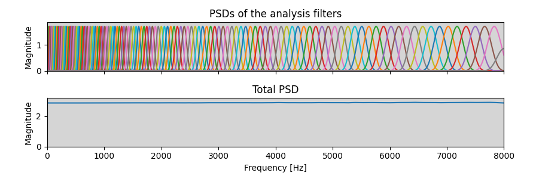

[](https://github.com/danedane-haider/HybrA-Filterbanks/blob/main/LICENSE)
[](https://github.com/danedane-haider/HybrA-Filterbanks/actions)
[](https://github.com/danedane-haider/HybrA-Filterbanks)

# HybrA-Filterbanks

HybrA-Filterbanks is a PyTorch package for auditory-inspired filterbanks in audio
machine learning.

It includes:

- `ISAC`: invertible and stable auditory filterbank with customizable kernels
- `HybrA`: ISAC extended with learnable channel-wise filters
- `ISACSpec`: ISAC-based spectrogram features with temporal averaging
- `ISACCC`: cepstral coefficients built on top of `ISACSpec`

Related papers:

- ISAC ([arXiv:2505.07709](https://arxiv.org/abs/2505.07709))
- HybrA ([arXiv:2408.17358](https://arxiv.org/abs/2408.17358))


## Installation

```bash
pip install hybra
```

## Quick Start

```python
import torch
import torchaudio
from hybra import ISAC

audio, fs = torchaudio.load("your_audio.wav")
audio = audio.to(torch.float32)
if audio.shape[0] > 1:
    audio = audio.mean(dim=0, keepdim=True)

fb = ISAC(
    fs=fs,
    L=audio.shape[-1],
    kernel_size=1024,
    num_channels=128,
    scale="mel",
)

coeff = fb(audio)
recon = fb.decoder(coeff)
print(f"coeff shape: {tuple(coeff.shape)}")
print(f"recon shape: {tuple(recon.shape)}")
```

## Typical Usage

### HybrA with learnable filters

```python
from hybra import HybrA

hybra = HybrA(
    fs=fs,
    L=audio.shape[-1],
    kernel_size=1024,
    learned_kernel_size=23,
    num_channels=128,
    tighten=True,
)

coeff = hybra(audio)
recon = hybra.decoder(coeff)
print(f"condition number: {hybra.condition_number:.3f}")
```

### ISAC spectrogram and cepstral coefficients

```python
from hybra import ISACCC, ISACSpec

spec = ISACSpec(
    fs=fs,
    L=audio.shape[-1],
    num_channels=40,
    power=2.0,
    is_log=True,
)
cc = ISACCC(
    fs=fs,
    L=audio.shape[-1],
    num_channels=40,
    num_cc=13,
)

spec_coeff = spec(audio)
cc_coeff = cc(audio)
print(spec_coeff.shape, cc_coeff.shape)
```

### Use in a neural network

```python
import torch
import torch.nn as nn
from hybra import HybrA

class Model(nn.Module):
    def __init__(self, fs: int, L: int):
        super().__init__()
        self.fb = HybrA(fs=fs, L=L, num_channels=40)
        self.net = nn.Sequential(
            nn.Conv1d(40, 128, kernel_size=1),
            nn.ReLU(),
            nn.Conv1d(128, 40, kernel_size=1),
            nn.Sigmoid(),
        )

    def forward(self, x: torch.Tensor) -> torch.Tensor:
        coeff = self.fb(x)
        mask = self.net(torch.log10(torch.clamp(coeff.abs() ** 2, min=1e-8)))
        return self.fb.decoder(coeff * mask)
```

## Visualizations

ISAC frequency response:


HybrA frequency response:


## Documentation

API docs: https://danedane-haider.github.io/HybrA-Filterbanks/main/

## Development

Run tests from the project root:

```bash
uv run pytest
```

## Citation

```bibtex
@inproceedings{haider2024holdmetight,
  author = {Haider, Daniel and Perfler, Felix and Lostanlen, Vincent and Ehler, Martin and Balazs, Peter},
  title = {Hold me tight: Stable encoder/decoder design for speech enhancement},
  booktitle = {Annual Conference of the International Speech Communication Association (Interspeech)},
  year = {2024}
}

@inproceedings{haider2025isac,
  author = {Haider, Daniel and Perfler, Felix and Balazs, Peter and Hollomey, Clara and Holighaus, Nicki},
  title = {{ISAC}: An Invertible and Stable Auditory Filter Bank with Customizable Kernels for ML Integration},
  booktitle = {International Conference on Sampling Theory and Applications (SampTA)},
  year = {2025}
}
```
